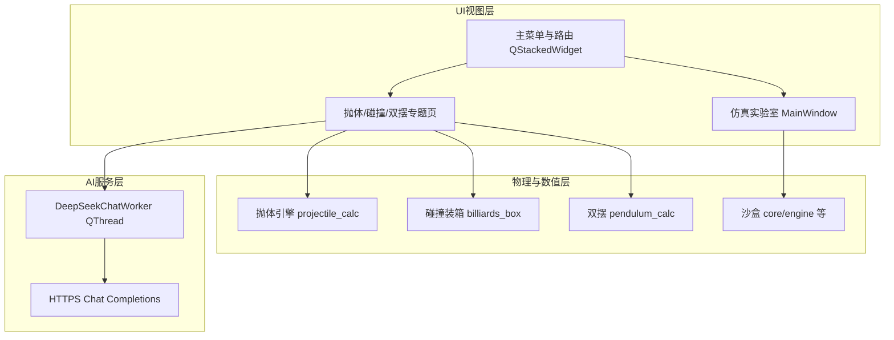

# 《基于交互式数值积分与刚体动力学的力学仿真教学平台》设计报告 — 正文填充稿

**特别声明（排版请严格执行）**

- **封面与正文任何位置均不写学校名称、作者姓名、指导教师姓名**（赛务扣分项）。
- 下文可直接粘贴至 Word；公式可用编辑器转为公式对象。

---

## 封面（内容留空）

**题目**：基于交互式数值积分与刚体动力学的力学仿真教学平台

**副标题（可选）**：设计报告

（日期、课程名等若赛方允许再填，**勿填个人信息**）

---

## 一、选题的意义和目标定位（对应要求 a）

### 1.1 传统力学教学的痛点

力学课程长期依赖板书与静态插图：其一，**非理想因素难以在实体实验中任意切换**——例如抛体运动中空气阻力随速度变化，实验室难以随意改变阻力系数并与理想抛物线同步对照。其二，**危险或不可重复场景**——碰撞分类与能量损失依赖恢复系数，实体装置往往限定于若干演示档位，难以系统扫描参数空间。其三，**混沌系统对初值极端敏感**——双摆在教学中若以口头描述「蝴蝶效应」，学生缺少可重复的轨迹分叉可视化。其四，**能量与守恒律的「微观监测」不足**——静态例题很少在同一界面连续给出轨迹、速度与系统机械能随时间的演化曲线。

### 1.2 目标定位

本项目定位为一款 **桌面端、参数可调、可视化完备** 的力学仿真教学软件：在保障物理模型与数值实现可追溯的前提下，提供 **沉浸式交互**（调节初值、阻尼、恢复系数等即时反馈），服务于课堂演示与学生自主探究两类场景。软件强调 **严谨数值计算与教学叙事并重**：既有面向考试的定性结论（守恒、耗散、对称性），也有面向理解的定量曲线（能量、相轨道）。

### 1.3 核心创新点（与实现对应）

1. **高精度显式积分与对照**：抛体与双摆等模块中，宏观仿真步内采用 **RK4 微步**（固定子步长拆分），并与 SciPy **`solve_ivp`（RK45）** 离线参考轨迹对照，避免「只用高中公式画图」而忽略数值模型一致性。
2. **仿真时序与显示的 Sub-stepping**：UI 以固定节拍驱动宏观步长；引擎内部再细分微步，缓解大步长带来的不稳定与视觉卡顿矛盾（碰撞模块另有 **子步碰撞迭代** 逻辑）。
3. **「教材图解—定向实验—AI 助教—自由沙盒」闭环**：专题实验页提供教材长图与可选 **DeepSeek API 助教**（后台 **`QThread`** 调用，避免阻塞界面）；第四模块为 **二维仿真实验室**，用于迁移巩固。

---

## 二、教学资源与仿真相关的物理原理（对应要求 b）

### 2.1 考虑空气阻力的抛体运动

取状态 \(s=[x,y,v_x,v_y]^T\)。重力竖直向下。阻力采用与 **速率平方成正比、方向与速度相反** 的模型：相应加速度项含 \(-(k/m)|\mathbf{v}| v_x\) 与竖直方向分量，\(k\) 为阻力系数，\(m\) 为质量。理想情形对应 \(k=0\) 的抛物运动；\(k>0\) 时方程为非线性常微分方程组，一般无单一解析射程公式，适合数值积分展示 **轨迹弯曲、射程缩短与机械能耗散**。

### 2.2 二维碰撞与恢复系数

两体质点碰撞沿连心线方向使用 **恢复系数 \(e\in[0,1]\)** 描述分离速度与接近速度之比；\(e=1\) 对应弹性极限，\(e<1\) 出现动能损失。动量守恒在碰撞瞬时成立（忽略外力冲量）。本平台装箱场景中辅以 **壁面反射** 简化边界，能量曲线用于观察 **非弹性碰撞导致的动能跃降** 及后续演化。

### 2.3 双摆的拉格朗日建模与混沌

双摆为 **两自由度耦合非线性系统**。以悬挂角 \(\theta_1,\theta_2\) 与角速度 \(\omega_1,\omega_2\) 描述状态，由拉格朗日量得到欧拉—拉格朗日方程；本平台同时允许 **关节粘性阻尼**（角加速度项叠加与角速度成正比的耗散），用于演示 **近似守恒与逐步衰减**。混沌特性表现为：**初值微小差异导致长时间轨迹显著分叉**，可在相空间（如下摆 \(\theta_2\)–\(\omega_2\)）上观察。

### 2.4 自由沙盒的刚体动力学基础（与实现一致）

仿真实验室模块基于 **自研二维物理引擎**（刚体/弹簧等简化模型）、**约束与碰撞检测**、以及 **摩擦与恢复系数** 等教学常用近似，配合 **`QGraphicsView`** 场景渲染与 **`pyqtgraph`** 数据面板。**说明**：本仓库实现 **未引入 Pymunk**；若大纲草稿中出现第三方物理引擎名称，应以实际代码为准撰写，避免评审质疑。

---

## 三、资源制作的流程与实现技术（对应要求 c）

### 3.1 系统架构（文字版结构图）

### 3.2 核心实现技术要点

- **界面路由**：`physical/Mechanics_Sim_Platform/main.py` 使用 **`QStackedWidget`** 切换主菜单、三个专题页与嵌入的仿真实验室窗口；专题页内部再用栈切换 **教学视图** 与 **仿真实验室视图**。
- **可视化**：Matplotlib 嵌入 **`FigureCanvasQTAgg`**；教材页长图采用可缩放控件展示；助教区基于 **QWebEngine + Markdown/MathJax**（实际运行依赖环境与网络策略）。
- **数值核心**：抛体参考轨迹 **`solve_ivp`**；实时推进 **RK4 微步**；碰撞 **子步迭代**；双摆 **RK4 微步**。
- **AI 助教**：`physical/Mechanics_Sim_Platform/ai/chat_worker.py` 中 **`DeepSeekChatWorker`** 继承 **`QThread`**，HTTP 客户端请求 **`stream: false`**，属 **整段返回** 而非 SSE 流式分块（报告中表述为异步请求、避免阻塞 UI，勿夸大「流式输出」）。
- **性能**：动画刷新采用 **`draw_idle`** 与坐标轴范围策略，减轻主线程负担。

---

## 四、平台使用方法与参数范围（对应要求 d）

### 4.1 沉浸式图文与 AI 助教

进入各专题 **教学视图**：左侧为教材长图与公式阅读区；右侧为助教对话区。首次使用需在主窗口 **「设置 → DeepSeek API 密钥」** 保存密钥；无密钥时仍可本地阅读教材并进入仿真实验室。**注意**：助教回答取决于模型与提示词，课堂使用应引导学生 **以仿真结果为准验证物理结论**。

### 4.2 定向实验参数（以软件控件为准，下同）

- **抛体**：初速度 **约 \(10\sim100\ \mathrm{m/s}\)**（滑块与数值框联动）；发射角 **\(0^\circ\sim90^\circ\)**；阻力系数 \(k\) **\(0\sim0.5\)**（示例范围）；质量 \(m\) **\(0.1\sim10\ \mathrm{kg}\)**；回放倍速调节宏观步长对应仿真时间。
- **碰撞**：两球质量、速率、方向角；非弹性模式下恢复系数 **\(0\sim1\)**（结合滑块与数值输入）；回放倍速。
- **双摆**：摆长、质量（滑块离散映射）；初始角 **`QDoubleSpinBox` 精度为小数点后两位（对应 \(0.01^\circ\) 量级表述成立）**；阻尼系数；仿真时长上限；播放倍速。

### 4.3 仿真实验室（沙盒）

通过仿真实验室创建小球、方块、弹簧、平台等对象，使用 **属性面板** 编辑参数；场景支持选择与删除；**数据面板** 绘制记录曲线。具体操作以界面控件为准。

---

## 五、结果合理性、有效性、局限与改进（对应要求 e）

### 5.1 物理含义与有效性论证（写作建议）

- **能量曲线**：理想抛体（\(k=0\)）机械能应近似水平；有阻力时动能+势能呈现耗散；双摆无阻尼时总机械能近似守恒，开启阻尼后单调下降。
- **对照轨迹**：抛体模块同时给出理想参考与实时 RK4 轨迹，可讨论数值误差来源（步长、模型简化）。
- **混沌对比**：双摆可固定其他参数，仅微调初始角，对比轨迹与相空间填充差异，解释 **李雅普诺夫意义下的敏感依赖**（定性描述即可）。

### 5.2 可拓展性

引擎与 UI 分层；新增专题页可在 **导航栈** 扩展；沙盒对象类型与模板可继续增加；AI 提示词与教材 Markdown 可替换为其他章节。**电磁学/光学**可作为后续模块接入同一壳层（需独立建模与验证）。

### 5.3 局限与改进

- **二维假设**：真实抛体与刚体碰撞的三维效应未建模。
- **模型简化**：阻力律、摩擦与碰撞模型均为教学近似。
- **数值方法**：长时间仿真可能存在能量漂移；可探索 **辛积分**、自适应步长或能量守恒格式；亦可引入 **3D 可视化**（OpenGL 等）作为远期方向。
- **AI 依赖网络与第三方 API**，课堂应有离线预案。

---

## 六、软件运行配置（对应要求 f）

### 6.1 硬件

- **最低建议**：64 位 CPU；**8 GB** 内存；集成显卡即可（2D 渲染为主）。
- **推荐**：更新一代 CPU；16 GB 内存；同时开启 Matplotlib 动画与 QWebEngine 助教时更从容。

### 6.2 软件与环境

- **操作系统**：开发与验证以 **Windows 10/11** 为主；PyQt5 理论支持 macOS/Linux，**若赛方要求需另行实测并写明**。
- **运行方式**：Python 解释器运行；依赖 **PyQt5、NumPy、SciPy、Matplotlib、pyqtgraph、httpx** 等（以项目依赖清单为准）。
- **可选**：打包为可执行文件需在报告中单独说明工具链与体积约束。

---

## 七、结论（对应要求 g）

### 7.1 成果总结

本项目将 **力学微分方程与碰撞模型** 落实为可交互软件：完成抛体、装箱碰撞、双摆与仿真实验室等模块，并以 **数值积分与图表监测** 支撑教学叙事，实现从公式到可视化结果的闭环。

### 7.2 教学价值展望

该平台可作为 **探究式课堂** 的演示与作业载体：学生通过改变参数「看见」守恒与耗散、周期与混沌；教师可将软件作为 **概念锚点**，配套纸质推导与实验录像形成混合式教学。

---

## 参考文献（按需）

1. 理论力学 / 分析力学教材（拉格朗日方程、碰撞理论）。
2. SciPy 文档：`solve_ivp`。
3. Butcher 表与 RK4/RK45 经典介绍（课程讲义或数值分析教材章节）。
